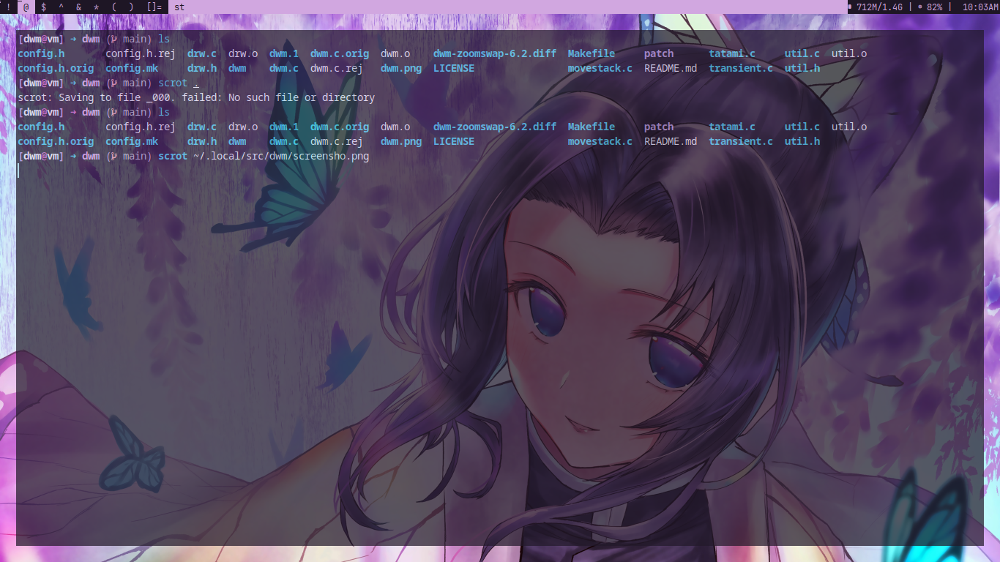

#dwm build 

#patch 

dwm-bottomstack-20160719-56a31dc.diff
dwm-clientindicators-6.2.diff
dwm-deck-6.2.diff
dwm-fadeinactive-20211114-a786211.diff
dwm-movestack-20211115-a786211.diff
dwm-noborder-6.2.diff
dwm-scratchpad-6.2.diff
dwm-setborderpx-6.2.diff
dwm-tatami-6.2.diff
